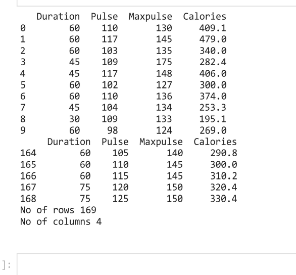

# Read-from-CSV

## AIM:To  write the python program to read the CSV file content.

## ALGORITHM:

### Step 1:
Load the CSV into the data frame.
### Step 2:
Print the number of contents to be displayed using df.head()
### Step 3:
The number of rows returned is defined in pandas option settings
### Step 4:
Check your systems maximum column with the pd.options.display.max.column statement.
### Step 5:
Increase the maximum number of the rows to display the entire data frame.
## PROGRAM:
import numpy as np
l1,l2=[],[]
n1,n2=int(input()),int(input())
for i in range (n1):
    for j in range (n2):
       values=int(input())
       l1.append(values)
    l2.append(l1)
    l1=[]
print(l2)
matrix=np.array(l2)
inverse=np.linalg.inv(matrix)
print(inverse)

## OUTPUT:

## RESULT:
Thus the aboveprogram is written to read the CSV file.
